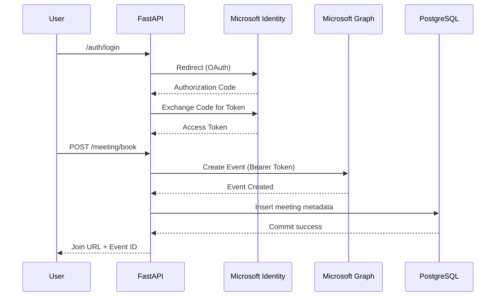

User
  ↓
FastAPI (Dockerized)
  ↓
Microsoft Identity Platform (OAuth 2.0)
  ↓
Microsoft Graph API
  ↓
Calendar Event Creation
  ↓
Teams Meeting Link Generation
  ↓
PostgreSQL (Dockerized Persistence)
  ↓
Structured Meeting Metadata Storage

## 🔄 Sequence Diagram

